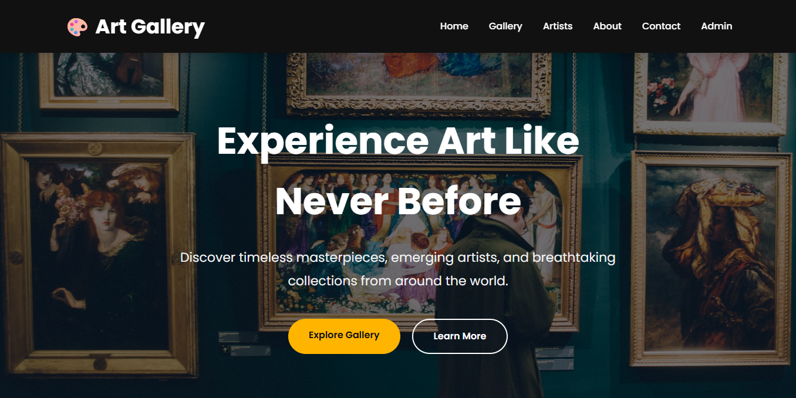
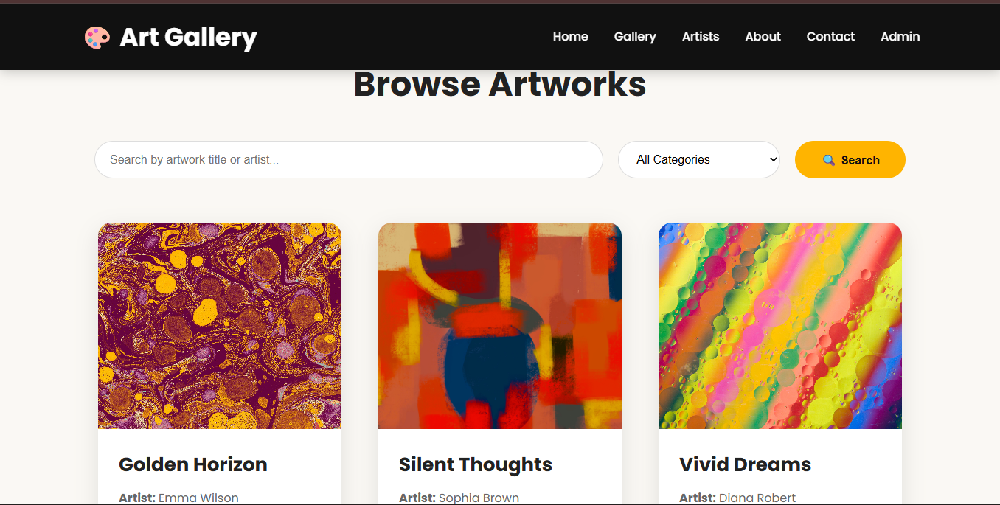
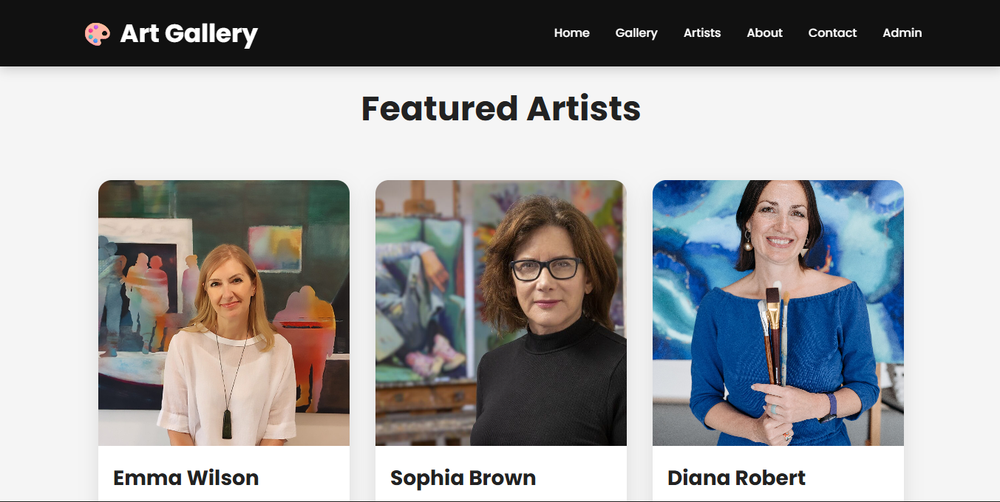
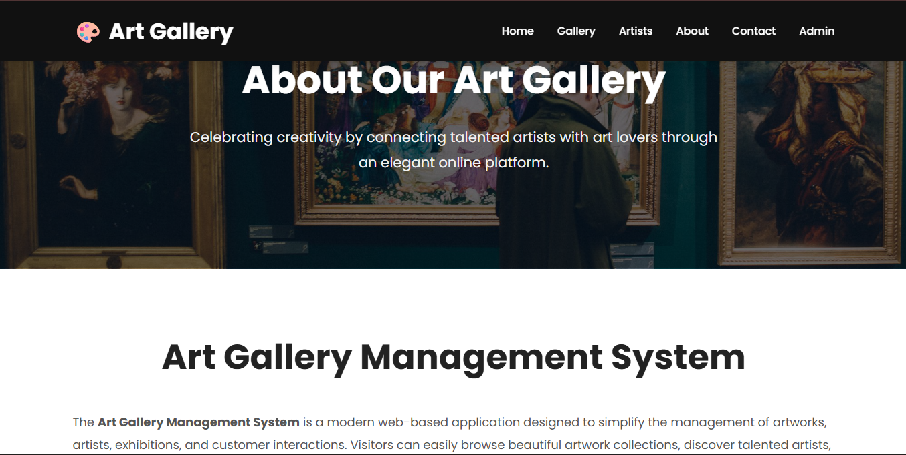
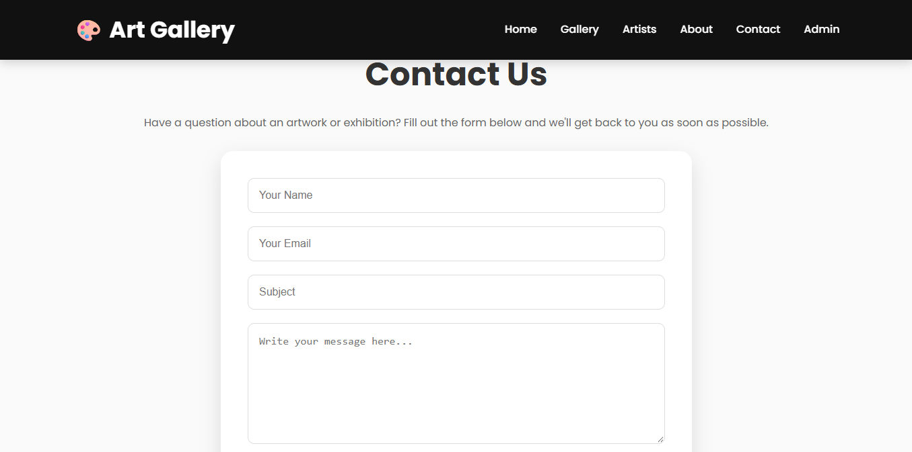
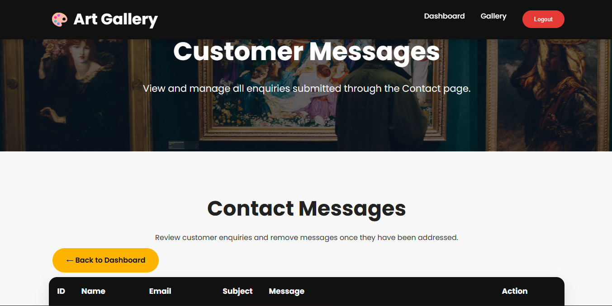

# 🎨 Art Gallery Management System

A web-based Art Gallery Management System developed using **Java, Spring Boot, Thymeleaf, HTML5, CSS3, JavaScript, and MySQL**.

The application provides a public-facing art gallery website along with a secure admin section for managing artworks and customer messages.

---

## 📌 Project Overview

The **Art Gallery Management System** is designed to provide a simple and organized platform for displaying artworks online and managing gallery information.

Visitors can browse artworks, search by title or artist, filter artworks by category, view artwork details, learn about artists and the gallery, and send messages through the contact page.

Administrators can securely log in to manage artworks and customer messages through an admin dashboard.

---

## ✨ Features

### 👤 Public Features

- 🏠 Home page.
- 🖼️ Artwork gallery.
- 🔍 Search artworks by title or artist.
- 🏷️ Filter artworks by category.
- 📄 View individual artwork details.
- 🎨 Artists page.
- ℹ️ About page.
- 📩 Contact form.
- ❌ Custom 403 Access Denied page.
- 🔎 Custom 404 Not Found page.
- 📱 Responsive user interface.

### 🔐 Admin Features

- 🔐 Secure admin login.
- 📊 Admin dashboard.
- 📈 Artwork statistics.
- ➕ Add artworks.
- ✏️ Edit artworks.
- 🗑️ Delete artworks.
- 📬 View customer messages.
- 🗑️ Delete customer messages.
- 🚪 Logout functionality.

---

## 🖥️ Application Preview

### 🏠 Home Page



---

### 🖼️ Gallery



---

### 👨‍🎨 Artists



---

### ℹ️ About



---

### 📩 Contact



---

### 🔐 Admin Login


---

### 📊 Admin Dashboard


---

### ➕ Artwork Form


---

### 📬 Customer Messages



---

## 🏗️ Application Architecture

The application follows a layered architecture based on the Spring Boot MVC approach.

```text
                    ┌─────────────────────┐
                    │      Browser        │
                    │   HTML / CSS / JS   │
                    └──────────┬──────────┘
                               │
                               ▼
                    ┌─────────────────────┐
                    │     Thymeleaf       │
                    │      Templates      │
                    └──────────┬──────────┘
                               │
                               ▼
                    ┌─────────────────────┐
                    │    Controllers      │
                    │   Spring MVC Layer  │
                    └──────────┬──────────┘
                               │
                               ▼
                    ┌─────────────────────┐
                    │      Services       │
                    │   Business Layer    │
                    └──────────┬──────────┘
                               │
                               ▼
                    ┌─────────────────────┐
                    │    Repositories     │
                    │ Spring Data JPA     │
                    └──────────┬──────────┘
                               │
                               ▼
                    ┌─────────────────────┐
                    │   Hibernate / JPA   │
                    └──────────┬──────────┘
                               │
                               ▼
                    ┌─────────────────────┐
                    │       MySQL         │
                    │      Database       │
                    └─────────────────────┘
```


---

## 🛠️ Technology Stack

| Technology | Purpose |
|---|---|
| Java | Application programming language |
| Spring Boot | Backend application framework |
| Spring MVC | Web request handling |
| Spring Data JPA | Database access |
| Hibernate | ORM implementation |
| Spring Security | Authentication and security |
| Thymeleaf | Server-side HTML rendering |
| HTML5 | Page structure |
| CSS3 | Styling and responsive design |
| JavaScript | Client-side interactions |
| MySQL | Relational database |
| Maven | Dependency management and build tool |

---

## 📂 Project Structure

```text
Art-Gallery-Management-System/
│
├── src/
│   ├── main/
│   │   ├── java/
│   │   │   └── com/
│   │   │       └── nishi/
│   │   │           └── artgallerymanagementsystem/
│   │   │               │
│   │   │               ├── config/
│   │   │               │   ├── SecurityConfig.java
│   │   │               │   └── UserConfig.java
│   │   │               │
│   │   │               ├── controller/
│   │   │               │   ├── HomeController.java
│   │   │               │   ├── LoginController.java
│   │   │               │   └── PageController.java
│   │   │               │
│   │   │               ├── entity/
│   │   │               │   ├── Artwork.java
│   │   │               │   └── Contact.java
│   │   │               │
│   │   │               ├── repository/
│   │   │               │   ├── ArtworkRepository.java
│   │   │               │   └── ContactRepository.java
│   │   │               │
│   │   │               ├── service/
│   │   │               │   ├── ArtworkService.java
│   │   │               │   ├── ArtworkServiceImpl.java
│   │   │               │   ├── ContactService.java
│   │   │               │   └── ContactServiceImpl.java
│   │   │               │
│   │   │               └── ArtgallerymanagementsystemApplication.java
│   │   │
│   │   └── resources/
│   │       ├── static/
│   │       │   ├── css/
│   │       │   ├── js/
│   │       │   └── images/
│   │       │
│   │       ├── templates/
│   │       └── application.properties
│   │
│   └── test/
│
├── docs/
│   └── screenshots/
│       ├── About.png
│       ├── Admin Dashboard.png
│       ├── Admin Login.png
│       ├── Artists.png
│       ├── Artwork Form.png
│       ├── Contact.png
│       ├── Gallery.png
│       ├── Home.png
│       └── Messages.png
│
├── .gitignore
├── pom.xml
└── README.md
```

---

## 🧩 Application Layers

### 🎯 Controller Layer

The controller layer handles HTTP requests and determines which operation should be performed.

Examples:

- `HomeController`
- `LoginController`
- `PageController`

`PageController` handles routes related to:

- Admin dashboard.
- Artwork CRUD operations.
- Gallery.
- Artwork details.
- Artists.
- About.
- Contact.
- Customer messages.

---

### ⚙️ Service Layer

The service layer contains the application's business logic and acts as an intermediary between controllers and repositories.

Main services:

- `ArtworkService`
- `ArtworkServiceImpl`
- `ContactService`
- `ContactServiceImpl`

---

### 🗄️ Repository Layer

The repository layer communicates with the database through Spring Data JPA.

Main repositories:

- `ArtworkRepository`
- `ContactRepository`

Spring Data JPA provides common database operations such as:

- Saving records.
- Retrieving records.
- Finding records by ID.
- Deleting records.
- Counting records.

The `ArtworkRepository` also provides search and category-based query methods.

---

### 📦 Entity Layer

The entity classes represent the application's database data.

### Artwork

The `Artwork` entity contains information such as:

- ID.
- Title.
- Artist.
- Category.
- Price.
- Image.
- Description.

### Contact

The `Contact` entity stores customer messages containing:

- ID.
- Name.
- Email.
- Subject.
- Message.

---

## 🔍 Artwork Search and Filtering

The gallery supports two main ways of finding artworks.

### Search

Users can search artworks by:

- Artwork title.
- Artist name.

The search uses Spring Data JPA derived query methods with case-insensitive partial matching.

### Category Filtering

Users can filter artworks by category.

The application checks the selected category and retrieves matching artworks from the database.

---

## 🔐 Security

Spring Security is used to protect the administrative section of the application.

Public pages include:

- Home.
- Gallery.
- Artists.
- About.
- Contact.
- CSS.
- JavaScript.
- Images.

The `/admin/**` section requires authentication.

The application also provides:

- Custom login page.
- Login success redirection.
- Logout functionality.
- Access denied page.

In this project, the administrator account is configured using Spring Security's in-memory user configuration.

---

## 📊 Admin Dashboard

The admin dashboard provides an overview of the gallery.

It displays information such as:

- Total artworks.
- Total categories.
- Total customer messages.

The administrators can also access artwork management and customer messages from the dashboard.

---

## 🗃️ Database

The application uses **MySQL** as its relational database.

The main application entities are:

```text
Artwork
   │
   ├── id
   ├── title
   ├── artist
   ├── category
   ├── price
   ├── image
   └── description

Contact
   │
   ├── id
   ├── name
   ├── email
   ├── subject
   └── message
```

Hibernate/JPA handles the mapping between Java entity objects and database tables.

---

## ⚙️ Configuration

Database configuration is stored in:

```text
src/main/resources/application.properties
```

The database password is supplied through an environment variable rather than being stored directly in the source code.

Example:

```properties
spring.datasource.url=jdbc:mysql://localhost:3306/artgallery
spring.datasource.username=root
spring.datasource.password=${DB_PASSWORD}
```

Before running the application, configure the `DB_PASSWORD` environment variable with your local MySQL password.


---

## 🚀 Getting Started

### 1. Clone the Repository

```bash
git clone https://github.com/nishisinghs/Art-Gallery-Management-System.git
```

### 2. Open the Project

Open the project in an IDE such as:

- IntelliJ IDEA.
- Eclipse.
- Spring Tool Suite.

### 3. Configure MySQL

Create a MySQL database named:

```text
artgallery
```

Now, configure the database credentials using the environment variable described above.

### 4. Run the Application

Run the Spring Boot main application:

```text
ArtgallerymanagementsystemApplication.java
```

The application will now start using the configured Spring Boot server.

### 5. Open the Website

Visit:

```text
http://localhost:8080/
```

---

## 🌐 Main Routes

| Route | Description |
|---|---|
| `/` | Home page |
| `/gallery` | Artwork gallery |
| `/artists` | Artists page |
| `/about` | About page |
| `/contact` | Contact page |
| `/login` | Admin login |
| `/admin` | Admin dashboard |
| `/admin/add` | Add artwork |
| `/admin/edit/{id}` | Edit artwork |
| `/admin/delete/{id}` | Delete artwork |
| `/admin/messages` | Customer messages |
| `/artwork/{id}` | Artwork details |

---

## 🔄 Core Application Flow

### Viewing Artworks

```text
User
  ↓
Gallery Page
  ↓
PageController
  ↓
ArtworkService
  ↓
ArtworkRepository
  ↓
MySQL
  ↓
Artwork Data
  ↓
Thymeleaf
  ↓
Browser
```

### Adding an Artwork

```text
Admin
  ↓
Artwork Form
  ↓
POST /admin/save
  ↓
PageController
  ↓
ArtworkService
  ↓
ArtworkRepository
  ↓
MySQL
  ↓
Redirect to Admin Dashboard
```

### Sending a Contact Message

```text
Visitor
  ↓
Contact Form
  ↓
POST /contact
  ↓
PageController
  ↓
ContactService
  ↓
ContactRepository
  ↓
MySQL
  ↓
Success Message
```

---

## 🎨 Frontend

The frontend is created using:

- HTML5.
- Thymeleaf.
- CSS3.
- JavaScript.

Thymeleaf is used to dynamically display backend data inside HTML templates.

Examples include:

- Displaying artwork information.
- Iterating through artwork lists.
- Displaying customer messages.
- Binding form fields.
- Showing success messages.

The CSS provides:

- Navigation styling.
- Hero sections.
- Artwork cards.
- Gallery layouts.
- Admin dashboard styling.
- Forms.
- Buttons.
- Responsive layouts.
- Animations and hover effects.

---

## 📱 Responsive Design

The interface includes responsive styling for different screen sizes.

The CSS contains responsive rules for:

- Desktop.
- Tablet.
- Mobile.
- Small mobile screens.

This allows the application interface to adapt to different device sizes.

---

## 💡 Project Highlights

- Layered Spring Boot architecture.
- MVC-based web application.
- CRUD operations for artworks.
- Search and category filtering.
- Server-side rendering using Thymeleaf.
- MySQL database integration.
- Spring Data JPA and Hibernate.
- Spring Security authentication.
- Admin dashboard.
- Customer contact management.
- Responsive frontend.
- Custom error pages.
- Environment-based database password configuration.

---
